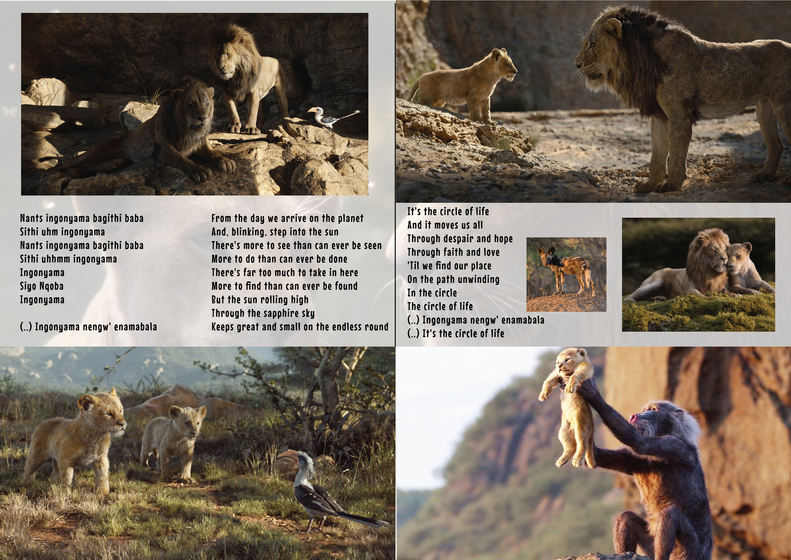

## Song List
* [Circle of Life](#circle-of-life)  
* [Hakuna Matata](#hakuna-matata)

<a name="circle-of-life">
## Circle of Life

Nants ingonyama bagithi Baba  
Sithi uhm ingonyama  

Nants ingonyama bagithi baba  
Sithi uhhmm ingonyama  
Ingonyama  

Siyo Nqoba  
Ingonyama  
Ingonyama nengw' enamabala  

From the day we arrive on the planet  
And blinking, step into the sun  
There is more to see than can ever be seen  
More to do than can ever be done  

There is far too much to take in here  
More to find than can ever be found  
But the sun rolling high  
Through the sapphire sky  
Keeps great and small on the endless round  

It's the Circle of Life  
And it moves us all  
Through despair and hope  
Through faith and love  
'Til we find our place  
On the path unwinding  
In the circle  
The Circle of Life  

It's the Circle of Life  
And it moves us all  
Through despair and hope  
Through faith and love  
'Til we find our place  
On the path unwinding  
In the circle  
The Circle of Life  

<a name="hakuna-matata">
## Hakuna Matata

<iframe width="560" height="315" src="https://www.youtube.com/embed/yUioIn8rPPM" frameborder="0" allow="accelerometer; autoplay; encrypted-media; gyroscope; picture-in-picture" allowfullscreen></iframe>

Hakuna Matata!  
What a wonderful phrase  
Hakuna Matata!  
Ain't no passing craze  

It means no worries  
For the rest of your days  
It's our problem-free philosophy  
Hakuna Matata!  

*Hakuna matata?*  
*Yeah, it's our motto*  
*What's a motto?*  
*Nothin', what's the motto with you?*  
*Ace! Boom!*  
*Those two words will solve all your problems*  

Why, when he was a young warthog  
When I was a young wart-hoooog!  

*How you feelin'? It's an emotional story*  

He found his aroma lacked a certain appeal  
He could clear the Savannah after every meal  
I'm a sensitive soul, though I seem thick-skinned  
And it hurt that my friends never stood downwind  

*I was here for you, and I resent that*  
*And, oh, the shame!*  
*Yes, he was ashamed*  
*I thought of changing my name!*  
*I mean, to what? "Brad"?*  
*And I got downhearted*  
*Every time that I farted... are you gonna stop me?*  
*No, I'm not. You disgust me!*  

Hakuna Matata! What a wonderful phrase  
Hakuna Matata! Ain't no passing craze  
It means no worries  
For the rest of your days  
Yeah, sing it, kid!  
It's our problem-free philosophy  
Hakuna Matata!  

(Instrumental)

Hakuna matata! (Hakuna matata, hakuna matata)  
Hakuna matata, yeah (Hakuna matata, hakuna matata)  
Hakuna matata, oh, ah (Hakuna matata, hakuna matata)  
(Hakuna matata, hakuna matata)  
It means no worries for the rest of your days  
(Hakuna matata, hakuna matata)  
(Hakuna matata, hakuna)  
It's our problem-free philosophy  
Hakuna matata  
 
*One more time !*  
*Oh, no, I think we did it*  
*I think we got this one*  
*But we're just getting in the groove*  
*No, let's leave 'em wanting more*  
*Yeah, you've grown 400 pounds since we started*  
*Meanwhile, I look exactly the same*  
*It means no worries, oh, yeah*  
*Will you tell him to stop*  
*Well, you insisted we sing this song*  
*I insisted you started singing it!*  
*It's our signature song, we shouldn't be sharing it!*  
*But it's our signature song so we have to* 
*Look, just tell him to stop*  
*It means no worries, ah, oh*  
*Oh, now he's riffing, Pumbaa, this is a nightmare*  
*It actually is kinda getting better*  
